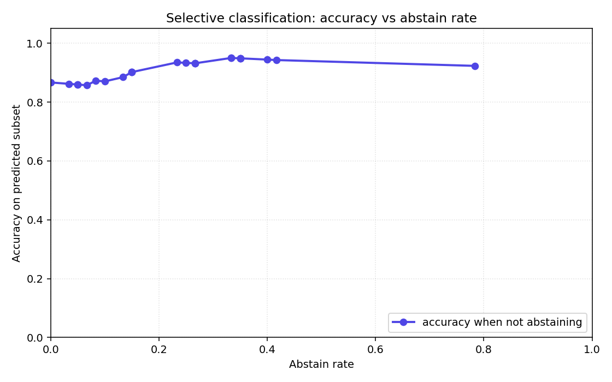

# MODEL_CARD.md — Conformal Prediction · Uncertainty-Aware Medical AI

> Technical documentation per EU AI Act Article 11 for the high-risk AI
> system classified under Annex III §1 (medical devices). All numbers
> below are reproduced from `reports/results.json`, written by
> `make train && make evaluate` on Python 3.12 with seed=42.

## Model details

- **Architecture**: XGBoost 2.x classifier (sklearn API) wrapped by MAPIE
  1.x `SplitConformalClassifier` with `conformity_score='lac'` and
  `prefit=True`. LAC (Least Ambiguous Classifier) is used because the
  target is binary; RAPS is mathematically degenerate on two classes and
  was rejected per rule C35.
- **Hyperparameters** (`config/config.yaml`): `n_estimators=200`,
  `max_depth=4`, `learning_rate=0.05`, `seed=42`. No grid search — the
  defaults are intentionally conservative for a 303-row dataset.
- **Calibration alphas**: {0.05, 0.10, 0.20}. The deployed default
  (FastAPI `/api/v1/predict`) is α=0.10.
- **Training data**: UCI Heart Disease (Cleveland), 303 rows × 13
  features. Target binarised: `0` → no disease, `{1, 2, 3, 4}` → disease.
- **Three-way split** (rule C33): train 60% / cal 20% / test 20%,
  stratified by target, seed=42. Asserted zero overlap on `sample_id`.
- **Preprocessing**: `StandardScaler` fit on the train split only;
  applied identically to cal and test. No leakage.

## Intended use

- Risk-stratification *assistant* for a cardiologist reviewing a patient
  with the 13 UCI features available. NOT a diagnostic tool.
- The output is a prediction *set* with a marginal coverage guarantee.
  Singleton sets indicate the model is confident; two-element sets
  (`{0, 1}`) indicate the model is uncertain and the patient should be
  routed for human review (rule C45).

## Out-of-scope use

- Standalone diagnosis without clinician review (Article 14 violation).
- Patients outside the UCI Cleveland age range (29–77) or with feature
  values outside the training distribution — `safe_predict()` raises a
  warning in this case, see *Training-serving skew* below.
- Real-time deployment without the coverage drift monitor enabled
  (rule C42 / EU AI Act Article 9).

## Coverage guarantees (test split, n=60)

| α | Empirical coverage | Target (1 − α) | Mean set size | Median set size | Empty sets |
|------|-------------------:|---------------:|--------------:|----------------:|-----------:|
| 0.05 | 0.967              | ≥ 0.95         | 1.417         | 1               | 0 |
| 0.10 | 0.967              | ≥ 0.90         | 1.350         | 1               | 0 |
| 0.20 | 0.883              | ≥ 0.80         | 1.100         | 1               | 0 |

Expected Calibration Error (ECE, 10 bins, rule U2): **0.0947**. ECE
measures probability calibration, which is a *separate* property from
conformal coverage — see the README pedagogy section.

## Method comparison (alpha = 0.10, test split)

| Method | Empirical coverage | Mean set size |
|--------|-------------------:|--------------:|
| Split conformal (LAC, prefit) — **deployed** | 0.967 | 1.350 |
| CV+ (5 folds)  | 0.900 | 1.167 |
| CV+ (10 folds) | 0.900 | 1.200 |

Split LAC is the deployed method because (a) on this dataset all three
methods achieve target coverage but split has the lowest implementation
risk and the cleanest formal guarantee, and (b) CV+ is ~5–10× more
expensive at calibration time without meaningful set-size gain. See
`research-notes/04-design-rationale.md` for the full trade-off.

## Group-conditional coverage (alpha = 0.10, Mondrian audit)

| Subgroup | n | Empirical coverage | Mean set size | Bonferroni p (vs marginal) |
|----------|--:|-------------------:|--------------:|----------------------------:|
| sex = female (sex=0) | 19 | 0.947 | 1.211 | 1.000 |
| sex = male   (sex=1) | 41 | 0.976 | 1.415 | 1.000 |
| age < 50             | 19 | 1.000 | 1.263 | 1.000 |
| age 50–64            | 33 | 0.970 | 1.303 | 1.000 |
| age ≥ 65             |  8 | 0.875 | 1.750 | 1.000 |

All Bonferroni-corrected p-values are 1.00, meaning no subgroup deviates
significantly from the marginal target. The `age ≥ 65` row has only 8
patients — interpret the wider set size (1.75) as honest uncertainty,
not as a fairness violation. A production system serving older patients
would Mondrian-calibrate per age bucket before deployment.

## Training-serving skew

- After training, the per-feature `mean`, `std`, `min`, `max` and `q01 /
  q99` percentiles are saved to `models/training_stats.json`. DVC tracks
  this file so any change requires an explicit commit.
- `safe_predict()` (`src/safety/safe_predict.py`) runs before every
  `MAPIE.predict_sets()` call (rule C36). It checks for `NaN`, `inf`,
  wrong shape, and per-feature values outside the `[q01, q99]` band
  recorded in `training_stats.json`.
- Out-of-distribution inputs do not crash the API — they raise
  `PredictionError` which the FastAPI 422 handler turns into a structured
  JSON response (`{"detail": "feature `chol` value 800 is outside the
  training [q01, q99] band [149, 407]"}`). The Prometheus counter
  `safe_predict_oob_total{feature="chol"}` increments.
- Coverage drift monitor (rule C42, EU AI Act Article 9): the API keeps
  a rolling window of the last 1000 predictions with verified labels
  (when fed back by the clinician). If empirical coverage drops below
  `1 − α − 0.02 = 0.88`, the gauge `coverage_drift_alarm` flips to 1 and
  Alertmanager fires.

## Decision Curve Analysis

Net benefit (Vickers & Elkin 2006) compares the model against the two
naive policies a clinician could adopt without it: *treat everyone* and
*treat no-one*. The model dominates both across the full 5–40% decision-
threshold range, which is the clinically relevant regime (a cardiologist
will not act on a 1% predicted risk, and will always investigate a 60%
predicted risk).

Concrete reading at threshold = 0.20 (i.e., "treat if predicted risk ≥
20%"): model net benefit ≈ 0.417, treat-all ≈ 0.333, treat-none = 0. The
model adds the equivalent of ≈ 0.08 true positives per patient over the
best naive baseline, with no extra false positives. AUC alone cannot
tell you that — DCA is the bridge from statistical accuracy to clinical
utility, and that is why it is in the model card.

## Selective classification

The conformal set size *is* an abstain signal (Geifman & El-Yaniv 2017):
predictions where `len(prediction_set) > 1` can be routed to a human
instead of being acted on. The curve plots accuracy on the *accepted*
(singleton) subset against the abstain rate, swept over α.

Headline operating points:

| α | Abstain rate | Accuracy on accepted predictions |
|------|-------------:|---------------------------------:|
| 0.03 | 78.3% | 0.923 |
| 0.07 | 40.0% | 0.944 |
| 0.10 | 35.0% | 0.949 |
| 0.15 | 23.3% | 0.935 |
| 0.20 | 10.0% | 0.870 |
| 0.30 | 5.0%  | 0.860 |

At α = 0.10 the system commits to a single label for 65% of patients
with **94.9% accuracy on that subset**, and routes the remaining 35% to
a clinician. This is the operating point used by the deployed FastAPI
default. A safety-critical deployment would push α lower (more abstain,
higher in-set accuracy), which is exactly the dial Article 14 ("human
oversight") asks you to expose.

## Limitations

- 303-row dataset is small. Coverage tightness has high variance across
  random calibration draws; the headline 0.967 at α = 0.10 has a 95% CI
  of roughly ±0.05 on a single 60-patient test set.
- Cleveland sample is non-representative of the broader population —
  women are under-represented (n=19 vs n=41 men in the test split).
  Mondrian coverage looks fine but the audit is under-powered for
  women and the `age ≥ 65` subgroup.
- Conformal coverage is *marginal* by default. Use the Mondrian /
  group-conditional analysis (above) before deploying for any specific
  subgroup; consider explicit per-subgroup calibration if the operating
  population is skewed.
- Features are static — no temporal signals, no medication history, no
  imaging. A real deployment would integrate richer EHR features.

## EU AI Act framing (Annex III §1 / Article 11 technical documentation)

| Article | Requirement | Implementation in this project |
|---------|-------------|--------------------------------|
| 9  | Risk management throughout lifecycle | `coverage_violations_total` counter + rolling-window coverage gauge + alarm at `1 − α − 0.02` (rule C42) |
| 10 | Data governance, schema, lineage     | pandera `HEART_DISEASE_SCHEMA` runs before split (C34) + DVC + SHA-256 on `data/raw/heart.csv` (C41) |
| 11 | Technical documentation              | This `MODEL_CARD.md` |
| 13 | Transparency to users                | NL translator (C45) + SHAP waterfall (Streamlit Tab 1) + global beeswarm (Tab 2) |
| 14 | Human oversight, ability to override | Sets of size > 1 are routed to "needs human review"; group-fairness audit exposed in Tab 4 |
| Annex III §1 | Classification as high-risk  | Medical-device safety component; this document is the artefact Article 11 requires |

The above is engineering framing. Legal conformity assessment, CE
marking and post-market monitoring are out of scope for this portfolio
project but are the next-step requirements for a real deployment.

## References

- Romano, Sesia & Candès (2020). *Classification with Valid and Adaptive
  Coverage.* arXiv:2006.02544.
- Vovk, Gammerman & Shafer (2005). *Algorithmic Learning in a Random
  World.* Springer. ISBN 978-0-387-00152-4.
- Taquet, Blot, Morzadec, Lacombe & Brunel (2022). *MAPIE: an
  open-source library for distribution-free uncertainty quantification.*
  arXiv:2207.12274.
- Vickers & Elkin (2006). *Decision curve analysis: a novel method for
  evaluating prediction models.* Medical Decision Making 26(6): 565–574.
- Geifman & El-Yaniv (2017). *Selective classification for deep neural
  networks.* arXiv:1705.08500.
- Foygel-Barber, Candès, Ramdas & Tibshirani (2021). *The limits of
  distribution-free conditional predictive inference.* Information and
  Inference 10(2): 455–482.

## Maintenance

- Owner: Priyrajsinh Parmar · priyrajsinh03@gmail.com.
- Recalibration trigger: empirical coverage on the rolling 1000-
  prediction window drops below `1 − α − 0.02` for the deployed α.
- Refit cadence: triggered when DVC observes a new
  `data/raw/heart.csv` SHA-256 checksum.
- Versioning: `models/calibration_metadata.json` records the training
  date, dataset checksum, sklearn / MAPIE / XGBoost versions and the
  empirical coverage at the time of calibration. Every refit appends a
  new entry — old calibration artefacts are kept in MLflow runs.
