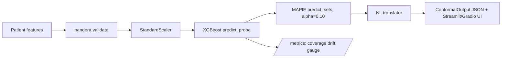
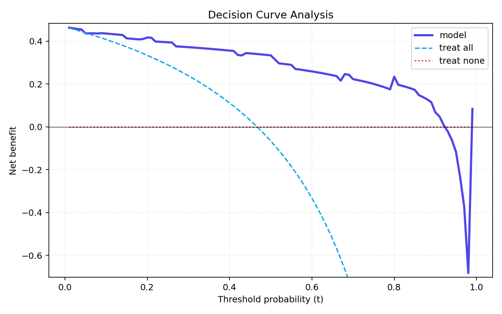

# Conformal Prediction · Uncertainty-Aware Medical AI

> Production-grade binary risk-stratification on UCI Heart Disease with
> **distribution-free coverage guarantees** via split conformal prediction.
> When the model is unsure, it says so — and that is provable, not heuristic.

[](LICENSE)
[](https://github.com/Priyrajsinh/Conformal-Prediction-Uncertainty-Aware-Medical-AI/actions/workflows/ci.yml)
[](https://www.python.org/downloads/release/python-3120/)
[](https://github.com/psf/black)

**[Try the live Gradio demo](https://huggingface.co/spaces/Priyrajsinh/conformal-prediction-medical-ai)** ·
**[Open the Streamlit dashboard](https://conformal-prediction-uncertainty-aware-medical-ai-priyrajsinh.streamlit.app/)** ·
**[GitHub repo](https://github.com/Priyrajsinh/Conformal-Prediction-Uncertainty-Aware-Medical-AI)**

---

## What it does

A typical classifier hands a clinician a single label — "heart disease" or
"no heart disease" — together with a probability that is hard to act on
because nobody told you what the calibration error was. This project hands
back a *set* of possible labels with a written guarantee: the true diagnosis
is inside that set at least 90% of the time, taken across all patients. When
the model is confident the set is a single label; when it is unsure the set
contains both, and the UI tells the clinician "uncertain — needs human
review". It is the model equivalent of a junior doctor who knows when to
escalate, rather than one who guesses with false confidence.

## Live demos

| Surface | Link | What you can do |
|---------|------|-----------------|
| Gradio (Hugging Face Space) | [huggingface.co/spaces/Priyrajsinh/conformal-prediction-medical-ai](https://huggingface.co/spaces/Priyrajsinh/conformal-prediction-medical-ai) | Enter 13 features, watch the streaming pipeline, get a patient-friendly verdict |
| Streamlit (Cloud) | [conformal-prediction-uncertainty-aware-medical-ai-priyrajsinh.streamlit.app](https://conformal-prediction-uncertainty-aware-medical-ai-priyrajsinh.streamlit.app/) | Four-tab dashboard: per-patient SHAP, global beeswarm, coverage + ECE plots, Mondrian comparison |
| Swagger / OpenAPI | `make serve` → http://localhost:8000/docs | Full FastAPI surface (predict, health, model_info, /metrics) |

## Quick start

```bash
make install         # pip install + pre-commit hooks
make train           # fit XGBoost + calibrate MAPIE on the cal split
make test            # pytest + coverage gate (>= 70%)
make serve           # FastAPI on :8000 (/docs, /metrics, /api/v1/health)
make gradio          # Gradio demo on :7860
make streamlit       # Streamlit dashboard on :8501
make audit           # pip-audit + detect-secrets + bandit
make ci              # full local mirror of .github/workflows/ci.yml
```

## Architecture



## Headline coverage results

Numbers below come straight from `reports/results.json` after running
`make train && make evaluate`. The test set has 60 patients and was held
out from both training and calibration (rule C33 — three-way split).

| α | Empirical coverage | Mean set size | Median set size |
|------|-------------------:|--------------:|----------------:|
| 0.05 | **0.967** (≥ 0.95) | 1.42 | 1 |
| 0.10 | **0.967** (≥ 0.90) | 1.35 | 1 |
| 0.20 | **0.883** (≥ 0.80) | 1.10 | 1 |

Expected Calibration Error (ECE, 10 bins): **0.095**. This is a *separate*
quantity from coverage — see the pedagogy section below.

## Group-conditional coverage (Mondrian)

Marginal coverage can hide subgroup failures. The table below is computed
at α=0.10 on the same 60-patient test split.

| Subgroup | n | Empirical coverage | Mean set size | Bonferroni p (vs marginal) |
|----------|--:|-------------------:|--------------:|----------------------------:|
| sex = female | 19 | 0.947 | 1.21 | 1.00 |
| sex = male   | 41 | 0.976 | 1.41 | 1.00 |
| age < 50     | 19 | 1.000 | 1.26 | 1.00 |
| age 50–64    | 33 | 0.970 | 1.30 | 1.00 |
| age ≥ 65     |  8 | 0.875 | 1.75 | 1.00 |

All p-values are 1.00, meaning no subgroup deviates significantly from the
marginal target after a Bonferroni correction. The `age ≥ 65` subgroup has
only 8 patients, however, so the absence of a detectable disparity should
be read as "we lack power to detect one" rather than "there is none". A
production deployment would Mondrian-calibrate (per-subgroup) before
trusting these numbers — see `research-notes/04-design-rationale.md`.

## Decision Curve Analysis



The model dominates both *treat-all* and *treat-none* across the full
range of clinically plausible decision thresholds (5–40% risk), which is
the regime where a cardiologist would actually use the score. Net-benefit
is the metric Vickers & Elkin (2006) showed translates accuracy into
clinical utility — AUC alone is not enough.

## How conformal prediction differs from probability calibration

This is the single most common confusion people bring to conformal
prediction, so it is worth being precise.

**Probability calibration** asks: when the model says "70% chance of
disease", does the disease actually occur in 70% of those patients?
Expected Calibration Error (ECE) measures the gap between the predicted
probability and the empirical frequency, averaged across bins. A well-
calibrated model has ECE close to zero.

**Conformal prediction** asks something stronger and quite different: can
we hand back a *set* of labels and prove that the true label is inside
that set with frequency ≥ 1 − α, taken across the entire test
distribution? That is the *marginal coverage guarantee*. Crucially, it is
distribution-free: it holds as long as the calibration data and the test
data are exchangeable, no matter how badly the underlying probabilities
are miscalibrated.

A concrete two-class example. Suppose the model returns
`P(disease) = 0.55` for every patient. ECE will be small if exactly 55%
of patients actually have the disease. But the *prediction* — flipping a
biased coin — is useless. Conformal prediction would notice this:
`predict_sets` would return the full set `{0, 1}` for almost every
patient, signalling "the model has no real information here". The
guarantee is then trivially satisfied (true label is always inside
`{0, 1}`), but the *set size* tells the clinician what the calibration
number hid.

Three flavours of coverage:

- **Marginal coverage** — `P(y ∈ C(X)) ≥ 1 − α`, averaged across all
  patients. What split conformal gives you out of the box. Strongest
  property: distribution-free and finite-sample.
- **Conditional coverage** — the same guarantee, but *for every value of
  X*. Impossible to achieve in finite samples without strong assumptions
  (Foygel-Barber 2021). RAPS and Mondrian approximate it.
- **PAC coverage** — the marginal guarantee holds with high probability
  over the draw of the calibration set, not just in expectation. Vovk's
  inductive conformal predictor.

When to use which: probability calibration is the right thing to optimise
if your downstream system consumes raw probabilities (cost-sensitive
optimisation, expected value calculations, anything Bayesian). Conformal
is the right thing if a human needs to *act* on the output — accept the
label, request a follow-up test, escalate — because the set size
literally encodes "do I have enough evidence here?".

In this project we report both numbers because they complement each
other: ECE ≈ 0.095 says the probabilities are not perfect (which is fine
on 303 training rows), and empirical coverage ≈ 0.967 at α = 0.10 says
that despite the imperfect probabilities the *sets* still bracket the
truth at the rate we asked them to.

## EU AI Act framing

A diagnostic-support classifier on patient data is a high-risk AI system
under the EU AI Act (Annex III §1, "AI systems intended to be used as
safety components in the management and operation of medical devices").
The relevant articles and how this project addresses each:

- **Article 9 — Risk management.** A continuous, documented risk-
  management process across the lifecycle. Implementation:
  `coverage_violations_total` counter and `mean_set_size_gauge` exposed
  at `/metrics`, plus the rolling empirical-coverage gauge with an alarm
  threshold from `config.yaml` (rule C42). If coverage on a rolling
  window drops below `1 − α − 0.02` the system trips an alert before the
  guarantee is breached at scale.
- **Article 10 — Data and data governance.** Training, validation and
  test datasets must be relevant, representative, free of errors and
  complete. Implementation: pandera `HEART_DISEASE_SCHEMA` validates
  every row before any split (rule C34); DVC tracks `data/raw/heart.csv`
  with a SHA-256 checksum at `data/raw/heart.csv.sha256` (rule C41); the
  three-way stratified split is asserted to have zero overlap on
  `sample_id` (rule C33).
- **Article 13 — Transparency.** Clinicians and patients must understand
  the system's outputs. Implementation: the NL translator converts
  prediction sets into "Likely heart disease (high confidence)" / "Likely
  no heart disease (high confidence)" / "Uncertain — needs human review"
  (rule C45); SHAP waterfall and beeswarm plots show why on the
  Streamlit dashboard.
- **Article 14 — Human oversight.** A natural person must be able to
  override outputs. Implementation: every uncertain prediction
  (`len(prediction_set) > 1`) is routed to the "needs human review"
  branch by the NL translator before it reaches the UI; the Streamlit
  dashboard exposes the Mondrian group-fairness audit so an oversight
  officer can see where the model is least reliable.
- **Annex III §1** classifies the system. **Article 11** then requires
  technical documentation — that document is `MODEL_CARD.md`, which
  carries the headline coverage numbers, group-conditional audit, DCA,
  selective classification curve, training-serving skew note and the
  recalibration trigger.

This is framing, not a legal opinion. A production deployment would also
need conformity assessment, post-market monitoring and CE marking — all
out of scope here.

## Tech stack

| Layer | Tool | Why |
|-------|------|-----|
| Base classifier | XGBoost 2.x | Strong on small tabular medical data, fast on CPU |
| Conformal wrapper | MAPIE 1.x (`SplitConformalClassifier`, prefit, LAC) | Maintained, sklearn-compatible, supports binary out of the box (rule C35) |
| Validation | pandera 0.20.x | Declarative, runs before the split, catches schema drift |
| Tracking | MLflow 2.x | Local file backend, no external service required |
| API | FastAPI + slowapi + Prometheus | Async, rate-limited, observable |
| UIs | Gradio 5.x + Streamlit 1.x | Streaming demo (HF Space) and clinician-facing dashboard |
| Data versioning | DVC | Reproducible data pipeline, checksum-driven refit |
| Quality gates | black, isort, flake8, mypy, bandit, radon, interrogate, pip-audit, detect-secrets | All run by `make ci`, mirrored 1:1 by GitHub Actions |

## Project structure

```
.
├── app.py                              # Streamlit entry-point
├── Makefile                            # Single source of truth for CI
├── config/config.yaml                  # Hyperparameters, alphas, paths
├── data/
│   ├── raw/                            # heart.csv (DVC-tracked, gitignored)
│   └── processed/                      # train/cal/test splits + checksums
├── hf_space/                           # Self-contained HF Space (no src/ imports)
├── models/                             # XGBoost + MAPIE artefacts + training_stats.json
├── reports/
│   ├── figures/                        # DCA, calibration, group coverage, selective
│   └── results.json                    # Coverage + ECE + DCA + selective numbers
├── research-notes/                     # 5 reading-log entries (Day 7)
├── src/
│   ├── api/                            # FastAPI app + Gradio demo + Streamlit glass.css
│   ├── data/                           # Loader, schema, three-way split, scaler
│   ├── evaluation/                     # Coverage, Mondrian, ECE, DCA, selective
│   ├── exceptions.py                   # PredictionError hierarchy
│   ├── models/                         # ConformalXGBoost (BaseMLModel ABC)
│   ├── monitoring/                     # Prometheus metrics + coverage drift
│   ├── safety/                         # safe_predict (NaN/inf/range checks)
│   └── training/                       # Train + calibrate entry-point
├── tests/                              # 70%+ coverage; integration + regression
├── MODEL_CARD.md                       # Article 11 technical documentation
├── README.md                           # This file
└── LICENSE                             # MIT
```

## References

- Romano, Sesia & Candès (2020). *Classification with Valid and Adaptive
  Coverage.* NeurIPS. [arXiv:2006.02544](https://arxiv.org/abs/2006.02544)
- Vovk, Gammerman & Shafer (2005). *Algorithmic Learning in a Random
  World.* Springer. ISBN 978-0-387-00152-4.
- Taquet, Blot, Morzadec, Lacombe & Brunel (2022). *MAPIE: an
  open-source library for distribution-free uncertainty quantification.*
  [arXiv:2207.12274](https://arxiv.org/abs/2207.12274)
- Vickers & Elkin (2006). *Decision curve analysis: a novel method for
  evaluating prediction models.* Medical Decision Making 26(6): 565–574.
  [doi:10.1177/0272989X06295361](https://doi.org/10.1177/0272989X06295361)
- Geifman & El-Yaniv (2017). *Selective classification for deep neural
  networks.* NeurIPS. [arXiv:1705.08500](https://arxiv.org/abs/1705.08500)

## Citation

If this project is useful in your own work, please cite as:

```bibtex
@software{parmar2026conformal_heart,
  author  = {Parmar, Priyrajsinh},
  title   = {Conformal Prediction · Uncertainty-Aware Medical AI},
  year    = {2026},
  url     = {https://github.com/Priyrajsinh/Conformal-Prediction-Uncertainty-Aware-Medical-AI},
  note    = {UCI Heart Disease · MAPIE · XGBoost · FastAPI · Gradio · Streamlit}
}
```

## License

Released under the [MIT License](LICENSE). The UCI Heart Disease dataset
is distributed by the UCI Machine Learning Repository under its own
terms — see `data/raw/README.md` if you plan to redistribute the CSV.
